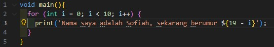
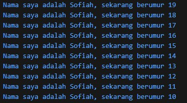
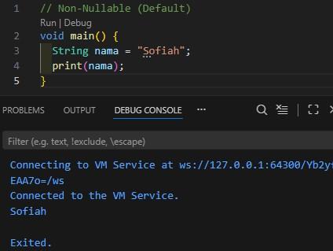
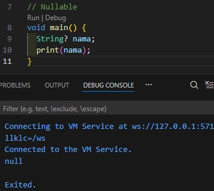
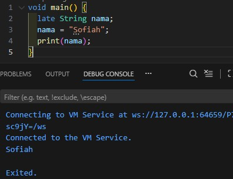

# Laporan Praktikum 02 : Pengantar Bahasa Pemrograman Dart - Bagian 1

Nama    : Sofiah  
NIM     : 244107060065  
Absen   : 20  

## Tugas Praktikum
1. Modifikasilah kode pada baris 3 di VS Code atau Editor Code favorit Anda berikut ini agar mendapatkan keluaran (output) sesuai yang diminta! Output yang diminta (Gantilah Fulan dengan nama Anda): 
 

2. Mengapa sangat penting untuk memahami bahasa pemrograman Dart sebelum kita menggunakan framework Flutter ? Jelaskan!
* Karena flutter dibangun menggunakan bahasa dart. Semua logika aplikasi, pengelolaan data, hingga interaksi backand juga menggunakan dart. Jika kita langsung memakai flutter tanpa memahami bahasa dart maka akan kesulitan memahami cara kerjanya. Dart juga menyediakan konsep penting seperti OOP, async/wait dan null safety yang menjadi pondasi dalam pengembangan aplikasi flutter.

3. Rangkumlah materi dari codelab ini menjadi poin-poin penting yang dapat Anda gunakan untuk membantu proses pengembangan aplikasi mobile menggunakan framework Flutter.
* Dart dirancang untuk OOP. Objek menyimpan kedua data(fields) dan kode(methods). Objek terbuat dari blueprint yang disebut class. Memastikan dart memiliki fitur encapsulation, inheritance, composition, abstraction dan polymorphism.
* Arithmetic operators. + untuk tambah, - untuk kurang, * untuk kali, / untuk bagi, ~/ untuk pembagian bilangan bulat, % untuk modulus(sisa bagi), dan -expression untuk negasi(membalik suatu nilai). Shortcut operator seperti +=, -=, *=, /=, dan ~/=.
* Operator Increment dan Decrement. ++var atau var++ untuk menambah nilai variable var sebesar 1. --var atau var-- untuk mengurangi nilai variable var sebesar 1
* Operator Equality dan Relational. == untuk memeriksa apakah operan sama. != untuk memeriksa pakah operan beda. > untuk memeriksa apakah operan kiri lebih besar dari operan kanan. < untuk memeriksa apakah operan kiri lebih kecil dari operan kanan. >= untuk memeriksa apakah operan kiri lebih besar dari atau sama dengan operan kanan. <= untukk memeriksa apakah operan kiri kurang dari atau sama dengan operan kanan.
* Operator Logical. !expression negasi atau kebalikan asil ekspresi yaitu true menjadi false dan false menjadi true. || untuk logika OR. && untuk logika AND.

4. Buatlah penjelasan dan contoh eksekusi kode tentang perbedaan Null Safety dan Late variabel !
* Null Safety adalah fitur yang memastikan variabel tidak boleh bernilai null kecuali diizinkan secara eksplisit. Di dart ada 2 jenis variabel yaitu Non-nullable tidak boleh null dan Nullable (?) boleh null. 
* ### Non Nullable  
* Nama wajib diisi nilai awal. Jika tidak diinisialisasi maka hasil compile error karena variabel non-nullable harus langsung diberi nilai 
*  
* ### Nullable (?)
* Nama boleh null / tidak diinisialisasi sehingga hasilnya yaitu null. 
*  

* Late Variable digunakan untuk mendeklarasikan variabel non-nullable, tapi diinisialisasi nanti (tidak langsung saat deklarasi) 
* Variabel dibuat tapi belum diisi, kemudian diberi nilai sebelum dipakai. Jika tidak diisi maka hasilnya yaitu Runtime Error: LateInitializationError 
* 