# Laporan Praktikum 03 : Pengantar Bahasa Pemrograman Dart - Bagian 2

Nama    : Sofiah  
NIM     : 244107060065  
Absen   : 20  

## Tugas Praktikum 1 : Menerapkan Control Flows ("if/else")
1. Ketik atau salin kode program berikut ke dalam fungsi main().  
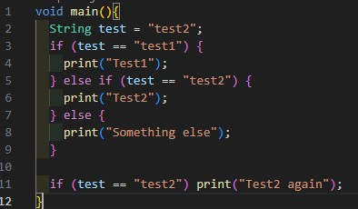 
2. Silakan coba eksekusi (Run) kode pada langkah 1 tersebut. Apa yang terjadi? Jelaskan!
* Ketika kode dijalankan, variabel test diisi dengan nilai "test2". Kemudian pada percabangan pertama, program mengecek apakah nilai test sama dengan "test1", namun karena hasilnya salah sehingga tidak dijalankan, lalu lanjut ke kondisi berikutnya yaitu apakah nilai test sama dengan "test2". Karena hasilnya true, maka program mencetak tulisan "Test2". Setelah itu lanjut ke percabangan kedua yaitu apakah nilai test sama dengan "test2", karena hasilnya true maka program mencetak "Test2 again". Sehingga saat di run, maka menampilkan teks "Test2" dan "Test2 again"
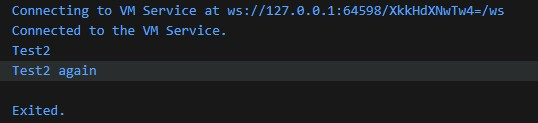 

3. Tambahkan kode program berikut, lalu coba eksekusi (Run) kode Anda. Apa yang terjadi ? Jika terjadi error, silakan perbaiki namun tetap menggunakan if/else.
* Terjadi compile-time error. Hal itu terjadi karena variabel test berupa String dengan nilai "true", sedangkan pada pengecekan if(test) kondisi yang dicek bertipe boolean. Bisa diperbaiki dengan mengubah tipe data menjadi boolean dan mengganti nama variabel karena variabel test sudah dipakai sebelumnya.  
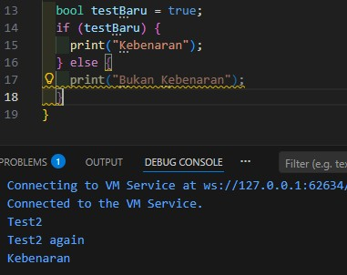  
Selain itu bisa juga menggunakan String, tapi dengan membandingkan nilainya.
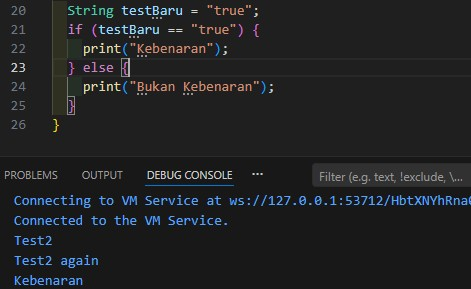  

## Tugas Praktikum 2: Menerapkan Perulangan "while" dan "do-while"
1. Ketik atau salin kode program berikut ke dalam fungsi main().  
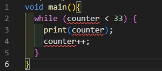 
2. Silakan coba eksekusi (Run) kode pada langkah 1 tersebut. Apa yang terjadi? Jelaskan! Lalu perbaiki jika terjadi error.
* Terjadi error karena variabel "counter" belum dideklarasikan/diinisialisasi sebelumnya. Agar program bisa berjalan, maka harus mendeklarasikan dan memberi nilai awal pada variabel counter sebelum perulangan while. Menambahkan baris "int counter = 1", sehingga program akan mencetak angka dari 1-32. Counter dimulai dari 1, perulangan berjalan selama counter < 33, setiap perulangan nilai counter bertambah 1, dan saat counter mencapai 33 maka kondisi menjadi false dan perulangan berhenti.
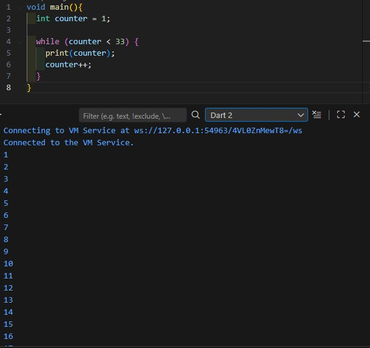 

3. Tambahkan kode program berikut, lalu coba eksekusi (Run) kode Anda. Apa yang terjadi ? Jika terjadi error, silakan perbaiki namun tetap menggunakan do-while.
* Setelah perulangan while (counter < 33) selesai dijalankan, nilai dari variabel counter yang awalnya 0 berubah menjadi 33. Ketika kode do-while ditambahkan, perulangan langsung mengeksekusi blok do terlebih dahulu tanpa mengecek kondisi. Artinya, program akan mencetak nilai counter mulai dari 33, kemudian nilainya terus bertambah satu setiap iterasi hingga mencapai 76. Perulangan akan berhenti saat counter bernilai 77 karena kondisi counter < 77 sudah bernilai false. Dengan demikian, output yang dihasilkan dari do-while adalah angka 33 sampai 76.
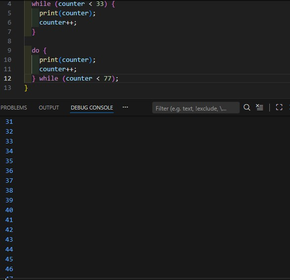 

## Tugas Praktikum 3 : Menerapkan Perulangan "for" dan "break-continue"
1. Ketik atau salin kode program berikut ke dalam fungsi main().  
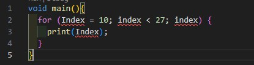 
2. Silakan coba eksekusi (Run) kode pada langkah 1 tersebut. Apa yang terjadi? Jelaskan! Lalu perbaiki jika terjadi error.
* Terjadi error karena variabel "index" belum dideklarasikan sebelumnya. Kemudian dart bersifat case-sensitive sehingga Index dan index dianggap sebagai dua variabel yang berbeda. Dan pada bagian increment harusnya menggunakan index++, tetapi di kode hanya tertulis index. Agar program dapat berjalan maka harus mendeklarasikan variabel index dengan tipe data int, kemudian menyamakan tulisan Index dan index, dan pada bagian increment ditulis index++.
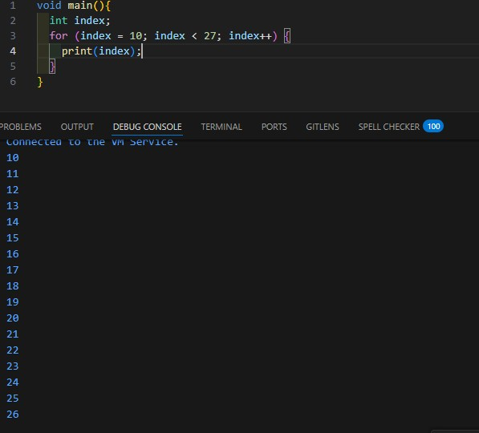 

* Setelah diperbaiki, program akan berjalan tanpa error dan menampilkan angka dari 10 sampai 26. Perulangan dimulai dari 10, akan terus berjalan selama nilai index kurang dari 27, dan setiap iterasi nilainya bertambah 1 hingga berhenti saat mencapai 27.

3. Tambahkan kode program berikut di dalam for-loop, lalu coba eksekusi (Run) kode Anda. Apa yang terjadi ? Jika terjadi error, silakan perbaiki namun tetap menggunakan for dan break-continue.
* Terjadi error/kesalahan pada bagian kondisi else if (index > 1 || index < 7). Hal itu menyebabkan output tidak muncul karena operator yang digunakan yaitu OR, sehingga pada perulangan dengan nilai index dari 10 sampai 26, kondisi index > 1 selalu bernilai true. Akibatnya, perintah continue selalu dijalankan pada setiap iterasi sebelum mencapai print(index).
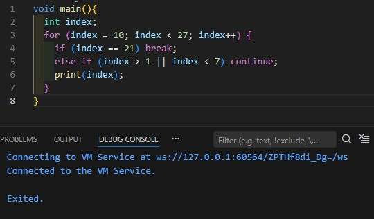 
* Agar program dapat berjalan dan mengeluarkan output, maka harus mengubah operator dari OR menjadi AND. Dengan begitu program akan mencetak angka mulai dari 10 dan berhenti ketika index bernilai 21 karena terkena perintah break. Kondisi index > 1 && index < 7 tidak berpengaruh pada rentang 10–20 karena tidak pernah terpenuhi. Akibatnya, output yang tampil adalah angka 10 sampai 20, lalu perulangan berhenti saat mencapai 21.
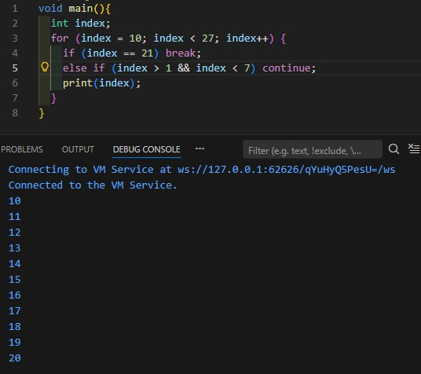 
