# Laporan Praktikum 04 : Pengantar Bahasa Pemrograman Dart - Bagian 3

Nama    : Sofiah  
NIM     : 244107060065  
Absen   : 20  

## Tugas Praktikum 1: Eksperimen Tipe Data List
1. Ketik atau salin kode program berikut ke dalam void main().  
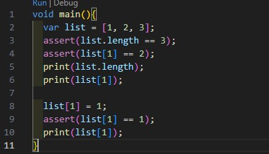 

2. Silakan coba eksekusi (Run) kode pada langkah 1 tersebut. Apa yang terjadi? Jelaskan!
* Hasil dari output kode tersebut adalah angka 3 2 1. Hal ini menunjukkan program berhasil dijalankan semua karena semua pernyataan assert bernilai benar. assert digunakan untuk memastikan kondisi tertentu terpenuhi saat debugging, jika terpenuhi maka akan lanjut ke program yang ada di baris selanjutnya. Jika kondisi assert bernilai false, program akan menghasilkan Assertion Error.
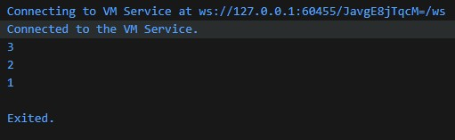 

3. Ubah kode pada langkah 1 menjadi variabel final yang mempunyai index = 5 dengan default value = null. Isilah nama dan NIM Anda pada elemen index ke-1 dan ke-2. Lalu print dan capture hasilnya. Apa yang terjadi ? Jika terjadi error, silakan perbaiki.
* Setelah kode diubah menjadi variabel final dengan panjang indeks 5 dan nilai awal null, program akan membuat sebuah list dengan lima elemen yang semuanya bernilai null. Hal ini dapat dilakukan menggunakan List.filled(5, null). Meskipun variabel list dideklarasikan sebagai final, isi dari elemen list tersebut masih dapat diubah selama referensi listnya tidak diganti dengan objek list yang lain. Kemudian pada indeks ke-1 diisi dengan nama dan pada indeks ke-2 diisi dengan NIM. Ketika program dijalankan dan hasilnya dicetak menggunakan print, akan terlihat bahwa elemen pada indeks 1 dan 2 berisi nilai yang telah dimasukkan, sedangkan elemen lainnya tetap bernilai null. 
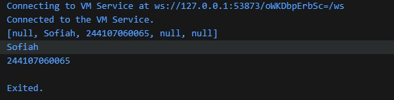  

## Tugas Praktikum 2: Eksperimen Tipe Data Set
1. Ketik atau salin kode program berikut ke dalam fungsi main().  
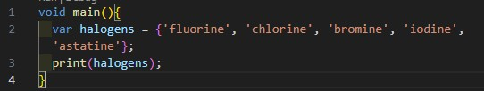 

2. Silakan coba eksekusi (Run) kode pada langkah 1 tersebut. Apa yang terjadi? Jelaskan! Lalu perbaiki jika terjadi error.
* Saat kode dijalankan, program berjalan tanpa error dan menampilkan isi variabel halogens di console. Penulisan dengan { } membuat variabel tersebut menjadi Set di Dart, yaitu kumpulan data yang berisi nilai unik. Output yang muncul adalah elemen fluorine, chlorine, bromine, iodine, dan astatine. 
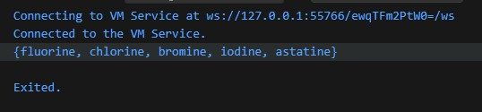 

3. Tambahkan kode program berikut, lalu coba eksekusi (Run) kode Anda. Apa yang terjadi ? Jika terjadi error, silakan perbaiki namun tetap menggunakan ketiga variabel tersebut. Tambahkan elemen nama dan NIM Anda pada kedua variabel Set tersebut dengan dua fungsi berbeda yaitu .add() dan .addAll(). Untuk variabel Map dihapus, nanti kita coba di praktikum selanjutnya.
* Saat kode dijalankan, names1 dan names2 akan dibuat sebagai Set kosong bertipe String, sedangkan names3 akan dibuat sebagai Map kosong, bukan Set. Hal ini terjadi karena penulisan {} tanpa tipe akan dianggap sebagai Map oleh Dart. Program tetap berjalan tanpa error, tetapi tipe data names3 berbeda dari yang diharapkan. Untuk memperbaiki sesuai arahan, variabel names3 dihapus. Kemudian ditambahkan nama dan NIM ke names1 menggunakan .add() dan ke names2 menggunakan .addAll(). Hasilnya, names1 berisi satu elemen yang ditambahkan dengan .add(), sedangkan names2 berisi dua elemen yang ditambahkan sekaligus menggunakan .addAll().
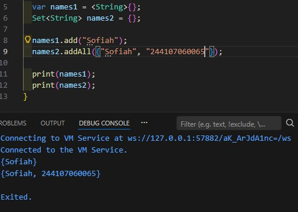 

## Tugas Praktikum 3: Eksperimen Tipe Data Maps
1. Ketik atau salin kode program berikut ke dalam fungsi main().  
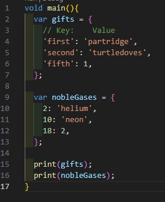 

2. Silakan coba eksekusi (Run) kode pada langkah 1 tersebut. Apa yang terjadi? Jelaskan! Lalu perbaiki jika terjadi error.
* Program berjalan tanpa error dan menampilkan isi dari dua variabel yaitu gifts dan nobleGases. Kedua variabel tersebut merupakan Map di Dart, yaitu struktur data yang menyimpan pasangan key dan value. Variabel gifts menggunakan key bertipe String, sedangkan nobleGases menggunakan key bertipe int. Output yang ditampilkan adalah seluruh pasangan key–value dari masing-masing Map.
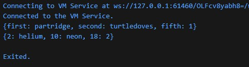 

3. Tambahkan kode program berikut, lalu coba eksekusi (Run) kode Anda. Apa yang terjadi ? Jika terjadi error, silakan perbaiki. Tambahkan elemen nama dan NIM Anda pada tiap variabel di atas (gifts, nobleGases, mhs1, dan mhs2).
* Saat kode dijalankan, program tetap berjalan tanpa error. Variabel gifts dan nobleGases adalah Map yang elemennya bisa ditambah atau diubah menggunakan pasangan key = value. Pada kode tersebut beberapa nilai di dalam gifts dan nobleGases diperbarui. Selain itu dibuat juga dua Map baru yaitu mhs1 dengan tipe Map<String, String> dan mhs2 dengan tipe Map<int, String>.
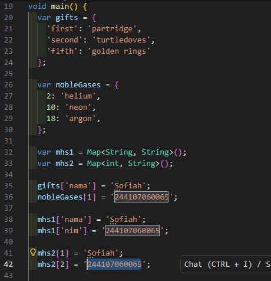 
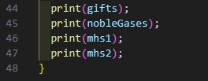 
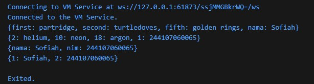 

## Tugas Praktikum 4: Eksperimen Tipe Data List: Spread dan Control-flow Operators
1. 1. Ketik atau salin kode program berikut ke dalam fungsi main().  
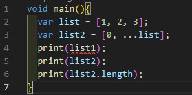 

2. Silakan coba eksekusi (Run) kode pada langkah 1 tersebut. Apa yang terjadi? Jelaskan! Lalu perbaiki jika terjadi error.
* Terjadi error karena pada perintah print(list1); variabel list1 tidak pernah dideklarasikan sebelumnya. Variabel yang ada hanya list dan list2. Akibatnya program tidak dapat dijalankan sampai error tersebut diperbaiki. Perbaikannya adalah mengganti list menjadi list1. Operator ... pada list2 adalah spread operator yang berfungsi untuk memasukkan seluruh elemen dari list ke dalam list2.
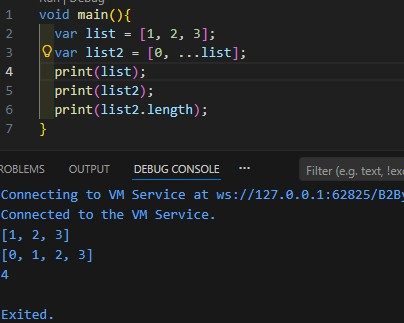 

3. Tambahkan kode program berikut, lalu coba eksekusi (Run) kode Anda. Apa yang terjadi ? Jika terjadi error, silakan perbaiki. Tambahkan variabel list berisi NIM Anda menggunakan Spread Operators. Dokumentasikan hasilnya dan buat laporannya!
* Saat kode dijalankan, akan muncul error karena variabel list1 belum dideklarasikan sebelumnya. Agar program dapat berjalan, list1 harus dideklarasikan terlebih dahulu. Pada kode tersebut juga digunakan null-aware spread operator (...?), yang berfungsi untuk menambahkan isi list ke list lain hanya jika nilainya tidak null. Jika list1 bernilai null, maka tidak akan terjadi error dan elemen tidak akan ditambahkan. Hasilnya, list3 akan berisi elemen dari list1 termasuk null karena list1 tidak bernilai null. Sedangkan listNim akan menampilkan list baru yang berisi angka 0 dan NIM yang dimasukkan menggunakan spread operator.
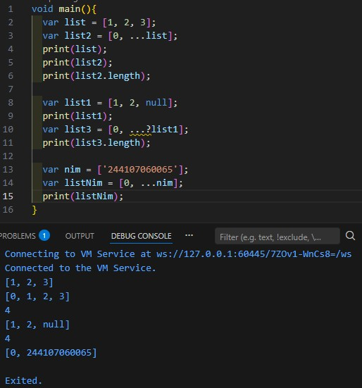 

4. Tambahkan kode program berikut, lalu coba eksekusi (Run) kode Anda. Apa yang terjadi ? Jika terjadi error, silakan perbaiki. Tunjukkan hasilnya jika variabel promoActive ketika true dan false.
* Saat kode dijalankan, akan terjadi error karena variabel promoActive belum dideklarasikan. Variabel tersebut harus dibuat terlebih dahulu agar kondisi if di dalam list dapat dijalankan.  
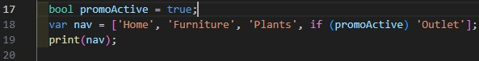 
* Jika promoActive = true, maka elemen 'Outlet' akan ikut ditambahkan ke dalam list. 
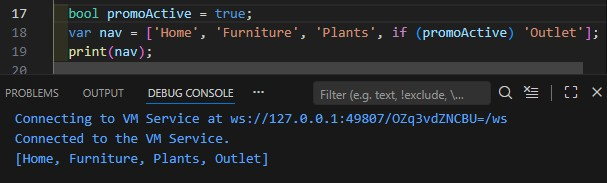 
* Jika promoActive = false, maka 'Outlet' tidak akan ditambahkan. 
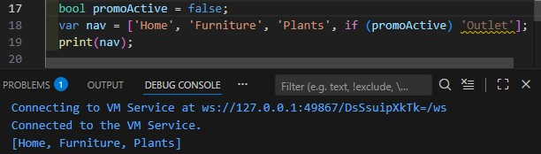 

5. Tambahkan kode program berikut, lalu coba eksekusi (Run) kode Anda. Apa yang terjadi ? Jika terjadi error, silakan perbaiki. Tunjukkan hasilnya jika variabel login mempunyai kondisi lain.
* Saat kode dijalankan, akan terjadi error karena variabel login belum dideklarasikan. Selain itu, sintaks if (login case 'Manager') memerlukan variabel yang memiliki nilai agar dapat dibandingkan. Untuk memperbaikinya, variabel login harus dibuat terlebih dahulu. 
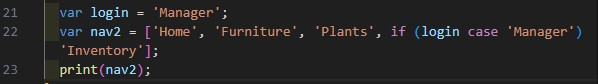 
* Jika login = 'Manager', maka 'Inventory' akan ditambahkan ke dalam list. 
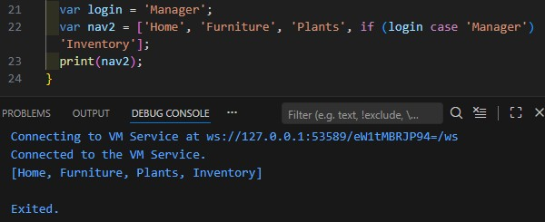 
* Jika login memiliki kondisi lain, misalnya 'User', maka 'Inventory' tidak akan ditambahkan. 
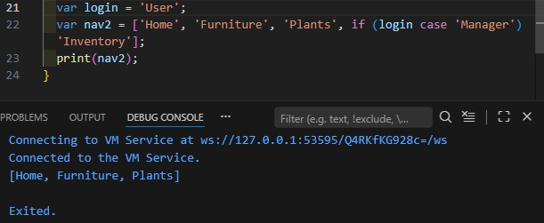 

6. Tambahkan kode program berikut, lalu coba eksekusi (Run) kode Anda. Apa yang terjadi ? Jika terjadi error, silakan perbaiki. Jelaskan manfaat Collection For dan dokumentasikan hasilnya.
* Saat kode dijalankan, program berjalan tanpa error. Variabel listOfInts berisi angka [1, 2, 3], kemudian pada listOfStrings digunakan Collection For untuk melakukan perulangan pada setiap elemen listOfInts dan menambahkannya ke dalam list sebagai string dengan format '#nilai'. Pernyataan assert(listOfStrings[1] == '#1') digunakan untuk memastikan bahwa elemen pada indeks ke-1 bernilai '#1'. 
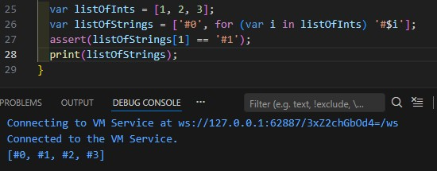 
* Manfaat Collection For adalah mempermudah pembuatan list secara dinamis langsung di dalam koleksi tanpa perlu membuat perulangan terpisah. Dengan fitur ini, kode menjadi lebih ringkas, mudah dibaca, dan efisien saat ingin menambahkan banyak elemen berdasarkan proses perulangan.

## Tugas Praktikum 5: Eksperimen Tipe Data Records
1. Ketik atau salin kode program berikut ke dalam fungsi main(). 
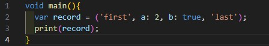 

2. Silakan coba eksekusi (Run) kode pada langkah 1 tersebut. Apa yang terjadi? Jelaskan! Lalu perbaiki jika terjadi error.
* Saat kode dijalankan, program berjalan tanpa error dan akan menampilkan isi dari variabel record. Kode tersebut menggunakan Record di Dart, yaitu struktur data yang dapat menyimpan beberapa nilai dengan tipe berbeda dalam satu variabel. Record ini memiliki positional fields ('first' dan 'last') serta named fields (a: 2 dan b: true). Artinya record berisi dua nilai posisi (first, last) dan dua nilai bernama (a bernilai 2 dan b bernilai true). Kode tersebut sudah benar sehingga tidak perlu perbaikan.
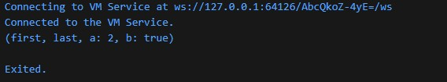 

3. Tambahkan kode program berikut di luar scope void main(), lalu coba eksekusi (Run) kode Anda. Apa yang terjadi ? Jika terjadi error, silakan perbaiki. Gunakan fungsi tukar() di dalam main() sehingga tampak jelas proses pertukaran value field di dalam Records.
* Kode tersebut tidak menghasilkan error jika diletakkan di luar main(). Fungsi tukar() menggunakan Record dan destructuring untuk mengambil nilai (a, b) dari record, lalu mengembalikannya dalam urutan yang ditukar yaitu (b, a). Agar terlihat proses pertukarannya, fungsi tersebut dipanggil di dalam main(). fungsi tukar() berhasil menukar posisi nilai pada record, dari (10, 20) menjadi (20, 10). 
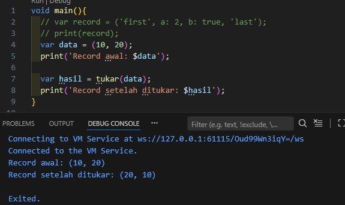 

4. Tambahkan kode program berikut di dalam scope void main(), lalu coba eksekusi (Run) kode Anda. Apa yang terjadi ? Jika terjadi error, silakan perbaiki. Inisialisasi field nama dan NIM Anda pada variabel record mahasiswa di atas. Dokumentasikan hasilnya dan buat laporannya!
* Saat kode dijalankan, akan terjadi error karena variabel mahasiswa hanya dideklarasikan tipe recordnya (String, int) tetapi belum diinisialisasi nilainya. Dalam Dart, variabel harus memiliki nilai sebelum digunakan, sehingga print(mahasiswa); tidak bisa dijalankan.Perbaikannya adalah dengan memberi nilai pada record tersebut dengan nama dan nim. Hasilnya yaitu variabel mahasiswa berisi record dengan dua field, yaitu String untuk nama dan int untuk nim, sehingga program dapat dijalankan tanpa error.
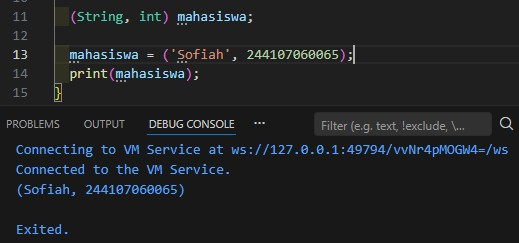 

5. Tambahkan kode program berikut di dalam scope void main(), lalu coba eksekusi (Run) kode Anda. Apa yang terjadi ? Jika terjadi error, silakan perbaiki. Gantilah salah satu isi record dengan nama dan NIM Anda, lalu dokumentasikan hasilnya dan buat laporannya!
* Saat kode dijalankan, program berjalan tanpa error. Variabel mahasiswa2 adalah Record yang memiliki positional field ('first' dan 'last') serta named field (a: 2 dan b: true). Nilai pada record dapat diakses menggunakan $1, $2 untuk positional field, dan menggunakan nama field seperti .a atau .b untuk named field.
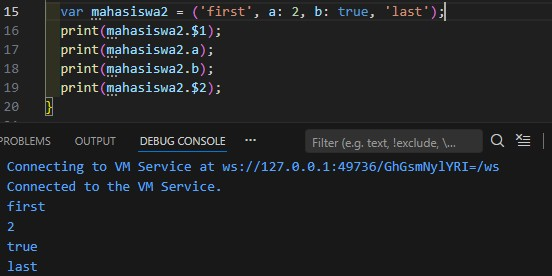 
* Jika isi record diganti dengan nama dan NIM, misalnya pada positional field, maka hasilnya menjadi seperti berikut
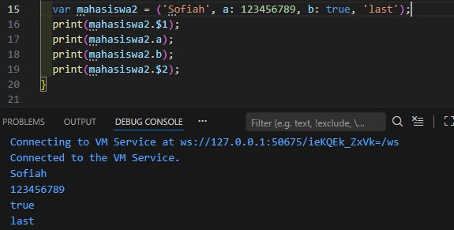 

## Tugas Praktikum
1. Silakan selesaikan Praktikum 1 sampai 5, lalu dokumentasikan berupa screenshot hasil pekerjaan Anda beserta penjelasannya!
2. Jelaskan yang dimaksud Functions dalam bahasa Dart!
* Sebuah blok kode yang digunakan untuk menjalankan tugas tertentu dan dapat dipanggil kembali ketika dibutuhkan. Fungsi membantu membuat program lebih terstruktur, mengurangi pengulangan kode, dan memudahkan pemeliharaan program.
3. Jelaskan jenis-jenis parameter di Functions beserta contoh sintaksnya!
* Required parameter: parameter yang harus diisi sesuai urutan
* Optional positional parameter: parameter opsional yang ditulis dengan []
* Named parameter: parameter ditulis dengan {} dan dipanggil berdasarkan nama
* Default parameter value: parameter memiliki nilai default jika tidak diisi 
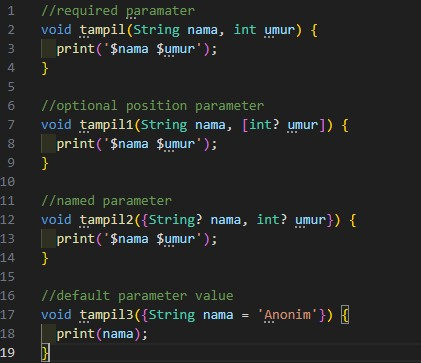 

4. Jelaskan maksud Functions sebagai first-class objects beserta contoh sintaknya! 
* Artinya adalah fungsi bisa disimpan dalam variabel, dikirim sebagai parameter, atau dikembalikan dari fungsi lain.
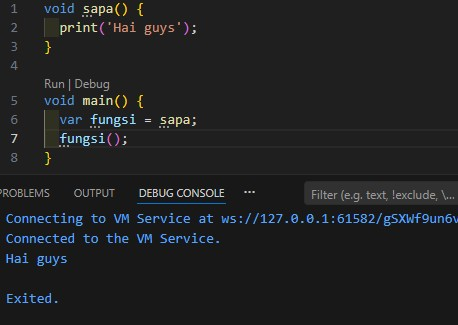 

5. Apa itu Anonymous Functions? Jelaskan dan berikan contohnya!
* Anonymous function adalah fungsi tanpa nama yang biasanya digunakan sebagai parameter atau langsung dipanggil dalam suatu operasi.
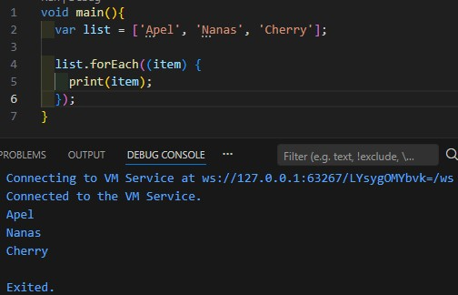 

6. Jelaskan perbedaan Lexical scope dan Lexical closures! Berikan contohnya!
* Lexical Scope adalah aturan bahwa variabel yang dapat diakses oleh sebuah fungsi ditentukan oleh lokasi kode tersebut ditulis. 
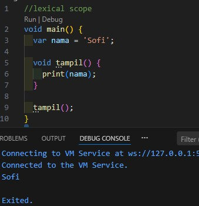 
* Lexical Closure adalah fungsi yang tetap dapat mengakses variabel dari scope tempat fungsi tersebut dibuat meskipun dijalankan di tempat lain. 
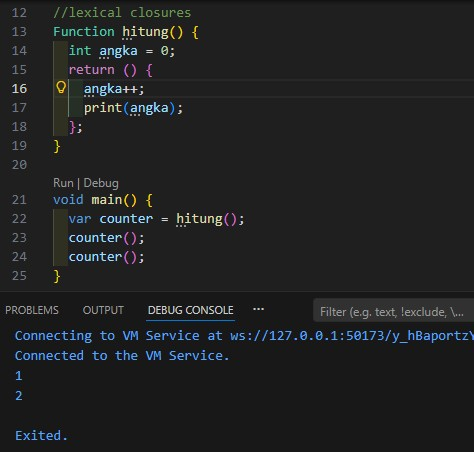 

7. Jelaskan dengan contoh cara membuat return multiple value di Functions! 
* Return multiple value adalah cara agar sebuah function dapat mengembalikan lebih dari satu nilai sekaligus. Pada bahasa Dart, hal ini dapat dilakukan menggunakan Record. Record memungkinkan beberapa nilai dengan tipe data berbeda digabungkan dalam satu hasil return dari function. Dengan menggunakan Record, function tidak hanya mengembalikan satu nilai seperti int atau String, tetapi dapat mengembalikan beberapa nilai sekaligus dalam satu struktur. 
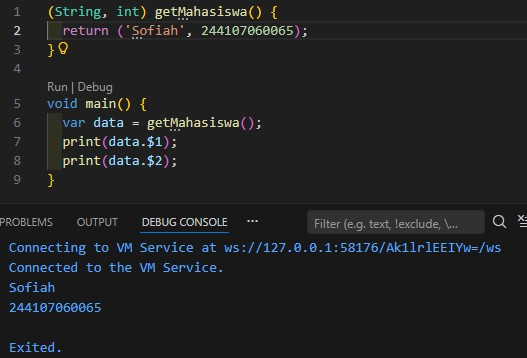 
* Pada contoh di atas, function getMahasiswa() mengembalikan dua nilai, yaitu String (nama) dan int (NIM). Kedua nilai tersebut dibungkus dalam record (String, int). Nilai pertama dapat diakses dengan data.$1, dan nilai kedua dengan data.$2.