# Laporan Tugas Praktikum 05 :  Codelabs Your first Flutter app

Nama    : Sofiah  
NIM     : 244107060065  
Absen   : 20  

## Membuat Project
1. Luncurkan Visual Studio Code dan buka palet perintah (dengan F1 atau Ctrl+Shift+P atau Shift+Cmd+P). Ketik "flutter new". Pilih perintah Flutter: New Project 
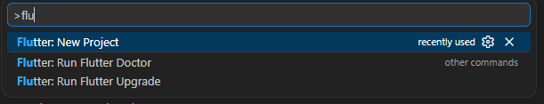 
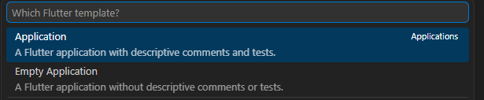 

2. Berikutnya, pilih Application lalu folder tempat proyek akan dibuat

3. Terakhir, beri nama proyek Anda. Beri nama seperti namer_app atau my_awesome_namer 
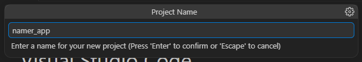 
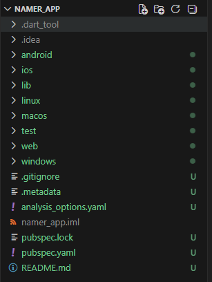 

4. Buka file pubspec.yaml. Ganti konten file ini dengan kode berikut 
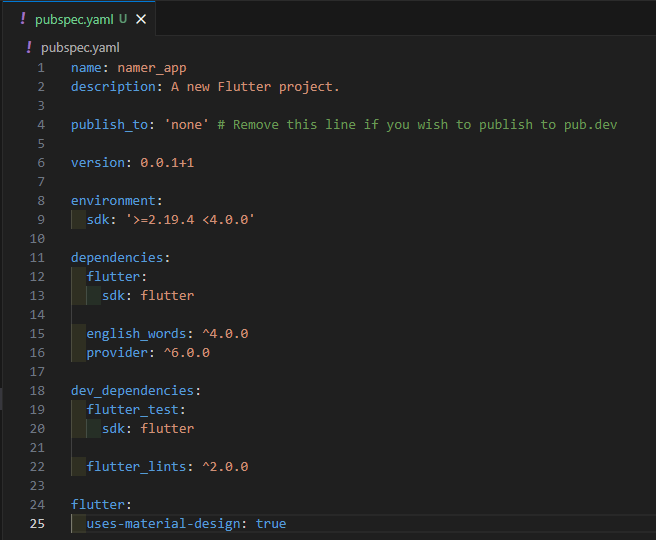 

5. Buka file konfigurasi lainnya dalam proyek tersebut, analysis_options.yaml. 
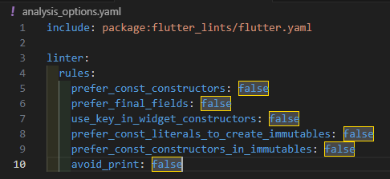 

6. Terakhir, buka file main.dart pada direktori lib/ Ganti konten file ini dengan kode berikut: 
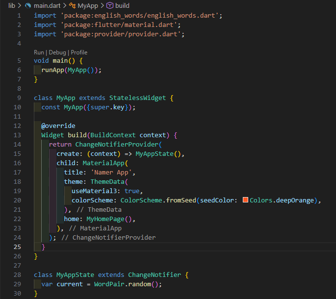 
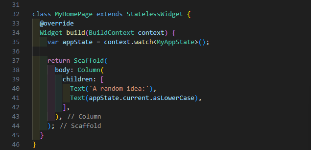 

## Menambahkan Tombol
1. Pertama, buka lib/main.dart dan pastikan Anda memilih perangkat target. Di bagian pojok kanan bawah VS Code, Anda akan menemukan tombol yang menampilkan perangkat target saat ini. Klik tombol untuk mengubahnya.  
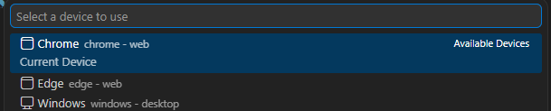 

2. Selagi lib/main.dart terbuka, temukan tombol "play" di pojok kanan atas jendela VS Code lalu klik tombol tersebut. Setelah beberapa saat, aplikasi Anda diluncurkan dalam mode debug. Tampilannya masih terlihat biasa saja.  
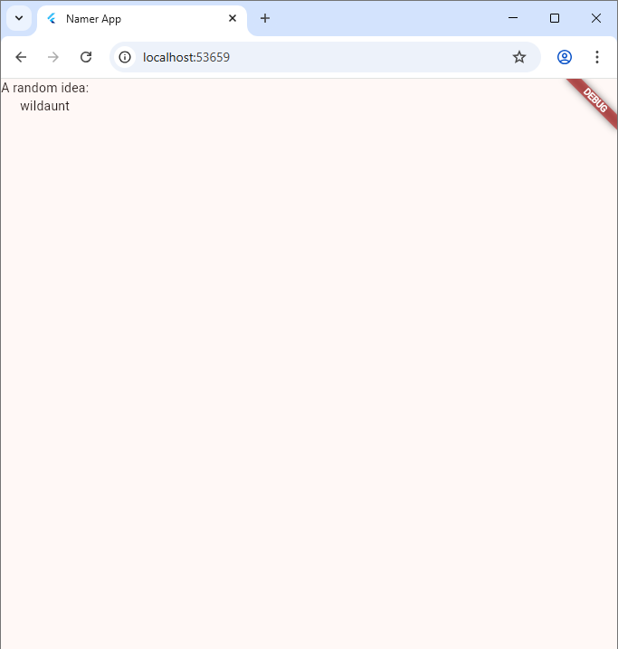 

3. Di bagian bawah lib/main.dart, tambahkan sesuatu pada string di objek Text pertama, dan simpan file tersebut (dengan Ctrl+S atau Cmd+S). Perhatikan bagaimana aplikasi segera berubah tetapi kata yang acak tetap sama. Situasi ini menunjukkan fitur stateful Hot Reload Flutter terkenal yang sedang bekerja. Hot reload dipicu saat Anda menyimpan perubahan untuk file sumber.  
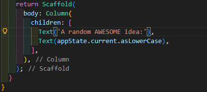 
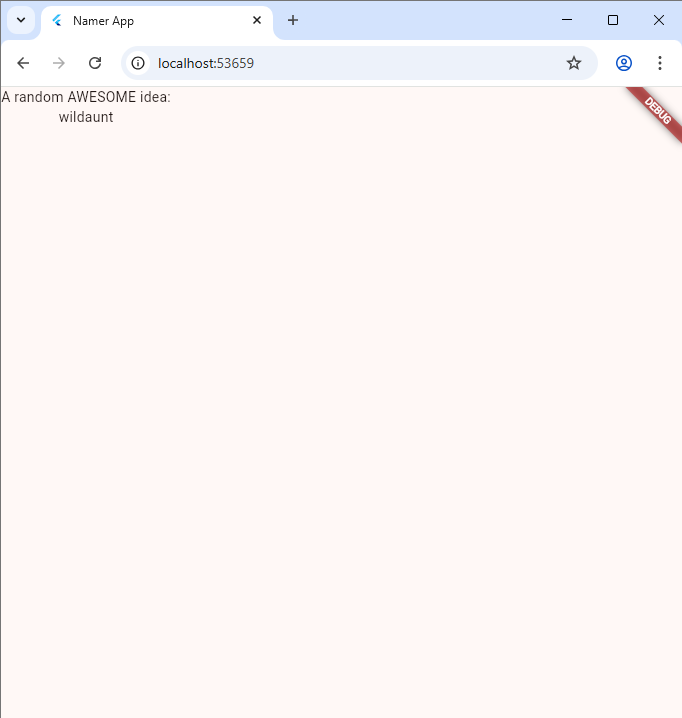 

4. Berikutnya, tambahkan tombol di bagian bawah Column, tepat di bawah instance Text kedua.  
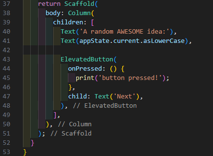 

5. Saat Anda menyimpan perubahan, aplikasi diperbarui kembali. Sebuah tombol muncul dan, saat Anda mengklik tombol tersebut, Konsol Debug di VS Code menampilkan pesan button pressed!. 
 
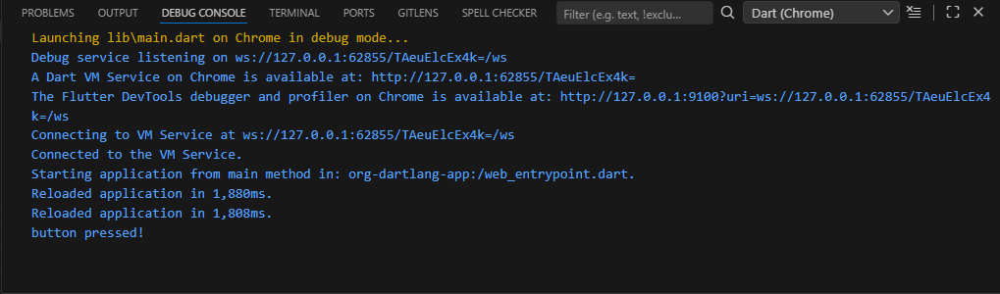 

6. Scroll ke MyAppState lalu tambahkan metode getNext.  
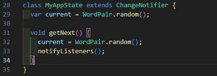 

7. Tindakan terakhir adalah memanggil metode getNext dari callback tombol tersebut.  
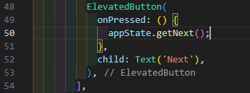 

8. Simpan dan uji coba aplikasi sekarang. Aplikasi akan menghasilkan pasangan kata acak baru setiap kali Anda menekan tombol Next.  
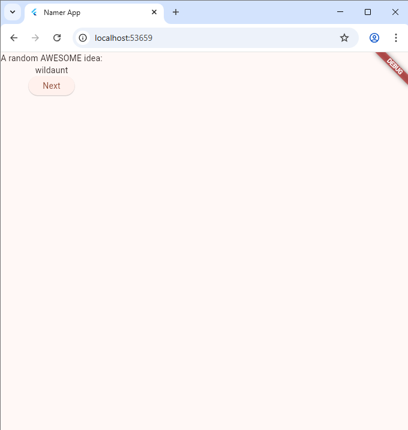 
 

## Memperindah Tampilan Aplikasi
1. Tulis ulang widget MyHomePage sebagai berikut  
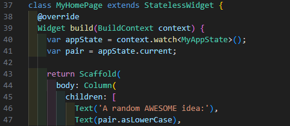 

2. Pindahkan kursor Anda ke potongan kode yang ingin Anda faktorkan ulang (dalam hal ini, Text), lalu tekan Ctrl+. (Win/Linux) atau Cmd+. (Mac). Pada menu Refactor, pilih Extract Widget. Tetapkan nama, seperti BigCard, lalu klik Enter.  
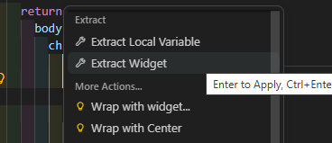 
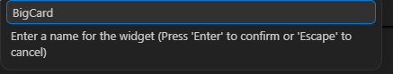 

3. Tindakan ini secara otomatis membuat class baru, BigCard, di akhir file saat ini. Class tersebut akan terlihat seperti berikut  
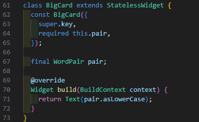 

4. Temukan class BigCard dan metode build() yang berada di dalamnya. Sama seperti sebelumnya, panggil menu Refactor pada widget Text, pilih Wrap with Padding. Tingkatkan padding dari nilai default 8.0. Misalnya, gunakan 20 untuk padding yang lebih luas.  
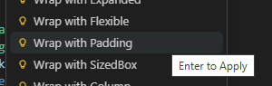 
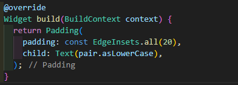 

5. Tempatkan kursor Anda pada widget Padding, buka menu Refactor, lalu pilih Wrap with widget. Ketik "Card" dan tekan Enter.  
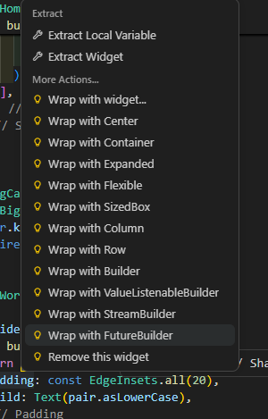 
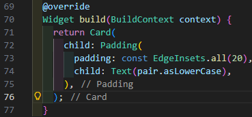 
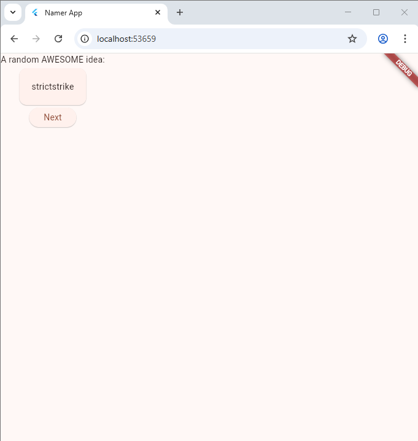 

6. Buat perubahan berikut untuk metode build() BigCard.  
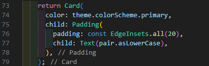 
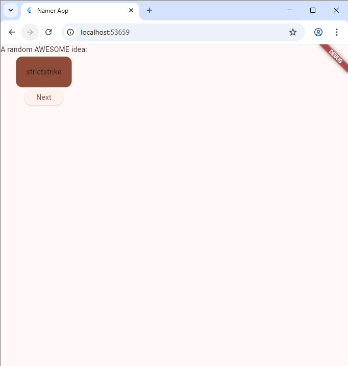 

7. Kartu tersebut masih memiliki masalah: ukuran teks terlalu kecil dan warnanya membuat teks sulit dibaca. Untuk memperbaiki masalah ini, buat perubahan berikut pada metode build() BigCard.  
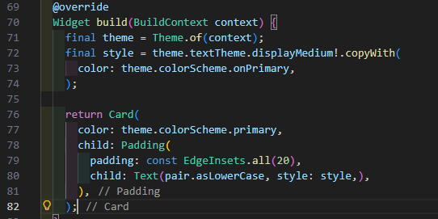 
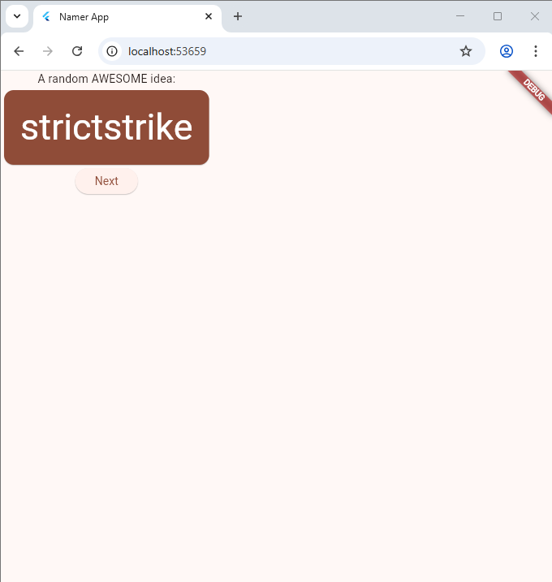 

8. Gunakan properti semanticsLabel Text untuk mengganti konten visual widget teks dengan konten semantik yang lebih sesuai untuk pembaca layar  
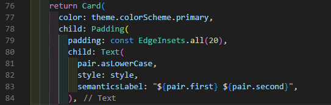 

9. Pertama, ingatlah bahwa BigCard adalah bagian dari Column. Secara default, kolom menggabungkan turunan kolom di bagian atas, tetapi kita dapat mengganti ini dengan mudah. Buka metode build() MyHomePage, dan buat perubahan berikut. Tindakan ini menempatkan turunan dalam Column di tengah pada sumbu utamanya (vertikal).  
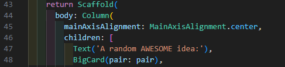 
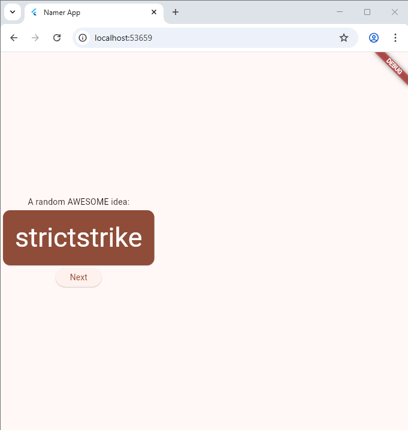 

10. Anda dapat menempatkan kolom itu sendiri di tengah. Letakkan kursor Anda di Column, buka menu Refactor (dengan Ctrl+. atau Cmd+.), lalu pilih Wrap with Center.  
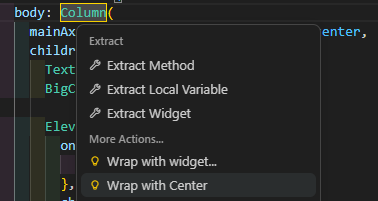 
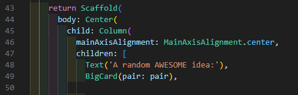 
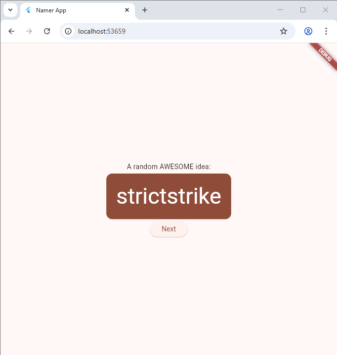 

11. Dengan perubahan opsional, MyHomePage mencakup kode berikut:Dengan perubahan opsional, MyHomePage mencakup kode berikut.  
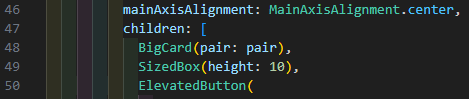 

12. Aplikasinya akan terlihat seperti berikut  
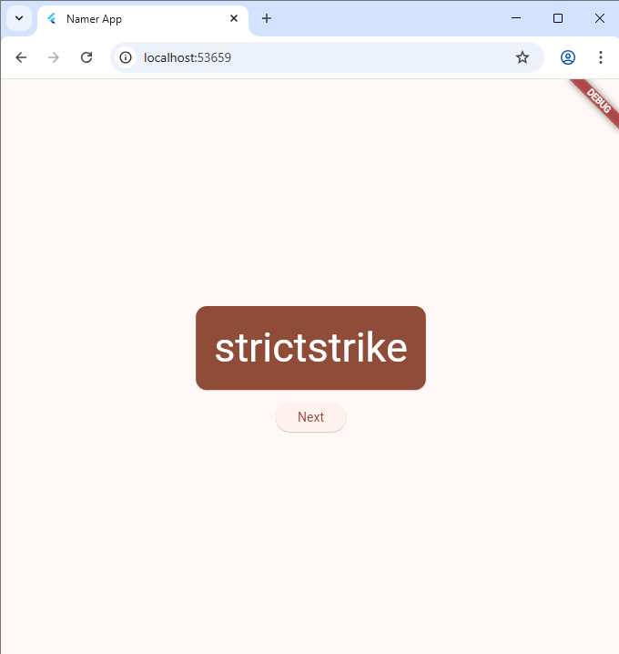 

## Menambahkan Fungsi
1. Scroll ke MyAppState dan tambahkan kode berikut 
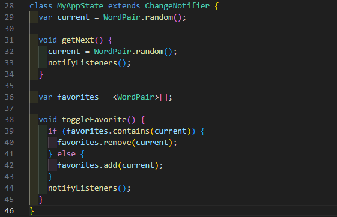 

2. Pertama, gabungkan tombol yang ada pada Row. Buka metode build() MyHomePage, letakkan kursor pada ElevatedButton, buka menu Refactor dengan Ctrl+. atau Cmd+., lalu pilih Wrap with Row.  
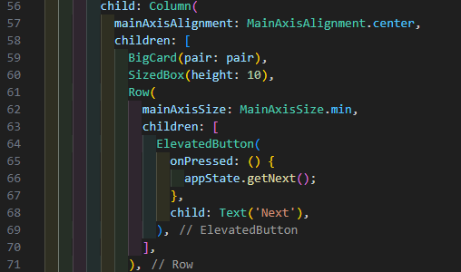 

3. Buat perubahan berikut:  
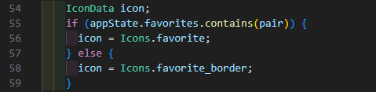 
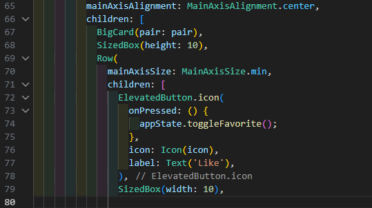 

4. Berikutnya, tambahkan tombol Like dan hubungkan ke toggleFavorite().  
 
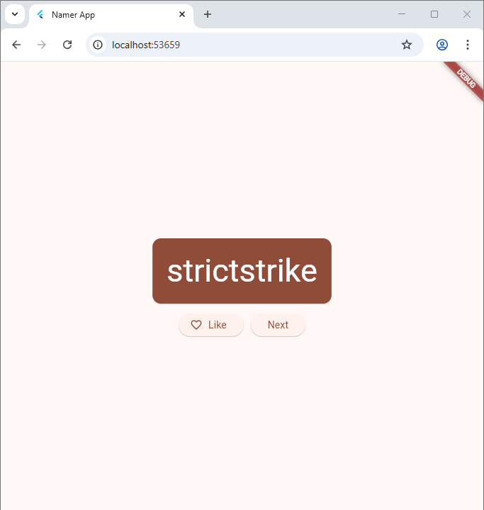 

## Menambahkan Kolom Samping Navigasi
1. Pilih keseluruhan MyHomePage, hapus, dan gantikan dengan kode berikut  
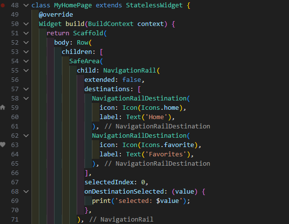 
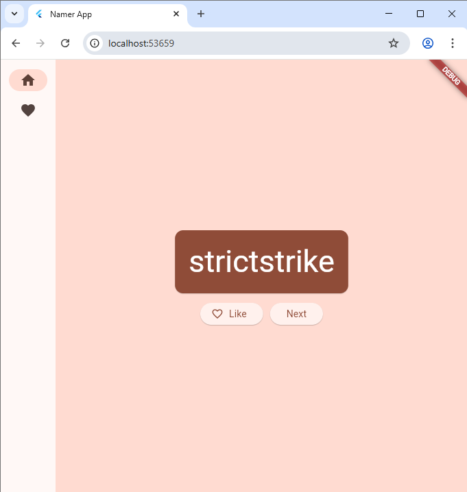 

2. Tempatkan kursor Anda di baris pertama MyHomePage (baris yang diawali dengan class MyHomePage...), lalu buka menu Refactor menggunakan Ctrl+. atau Cmd+.. Kemudian, pilih Convert to StatefulWidget.  
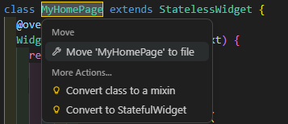 

3. Widget stateful baru hanya perlu melacak satu variabel: selectedIndex. Buat 3 perubahan berikut untuk _MyHomePageState  
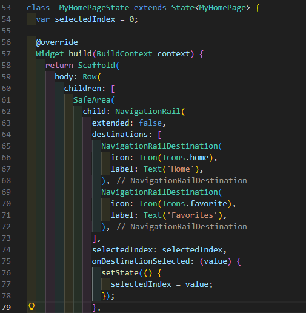 
 
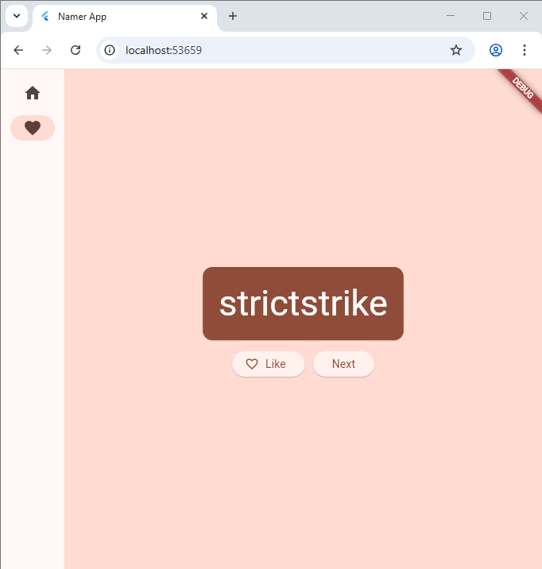 

4. Tempatkan kode berikut di bagian atas metode build _MyHomePageState, tepat sebelum return Scaffold  
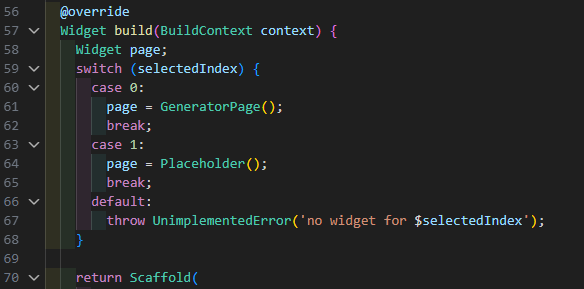 

5. Berikut tampilan _MyHomePageState setelah satu perubahan tersebut  
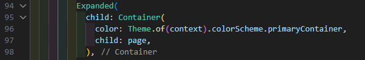 
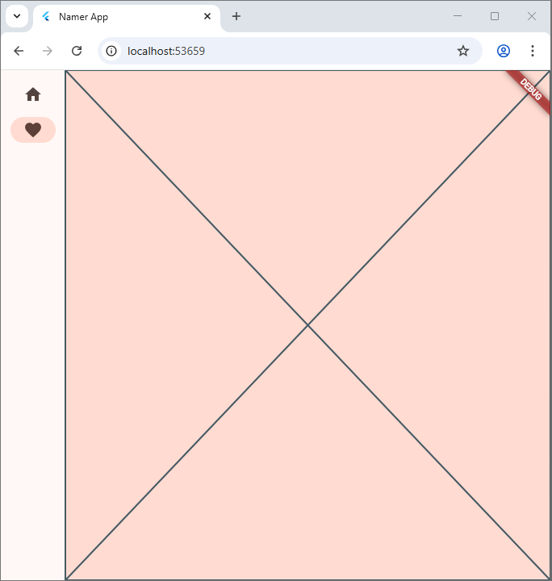 

6. Sekarang kode Anda dapat memutuskan untuk menampilkan label dengan membuat kueri constraints saat ini atau tidak. Buat perubahan baris tunggal berikut untuk metode build _MyHomePageState  
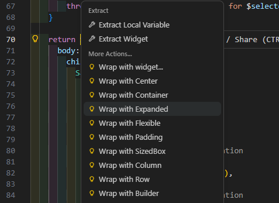 
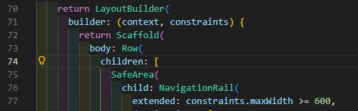 
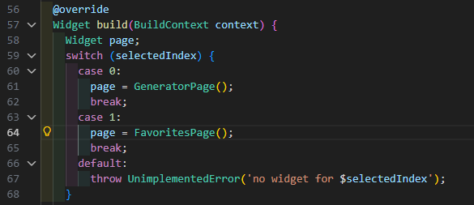 
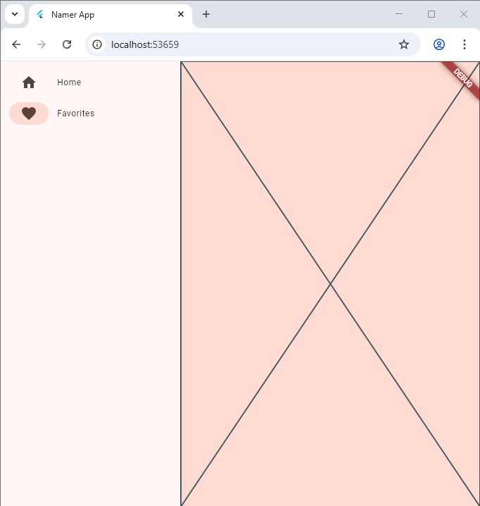 
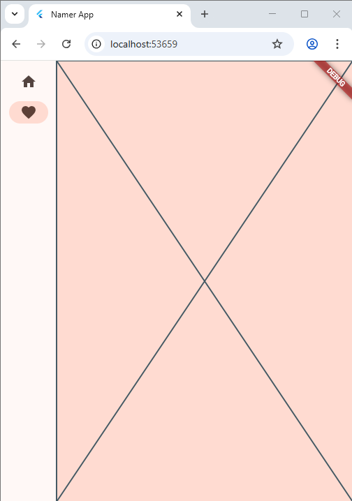 

## Menambahkan Halaman Baru
1. Berikut class FavoritesPage baru  
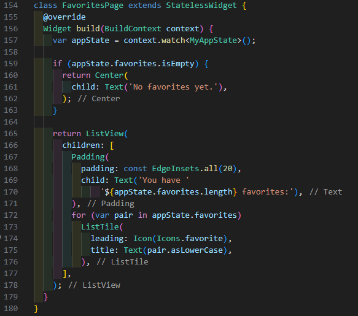 

2. Hasil  
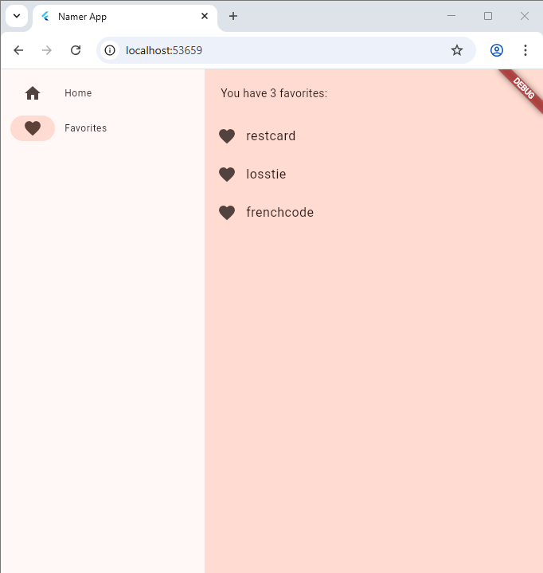 

## Langkah Berikutnya
1. Bereksperimenlah lebih lanjut dengan aplikasi yang Anda buat selama menjalani lab ini. Berikut hasilnya
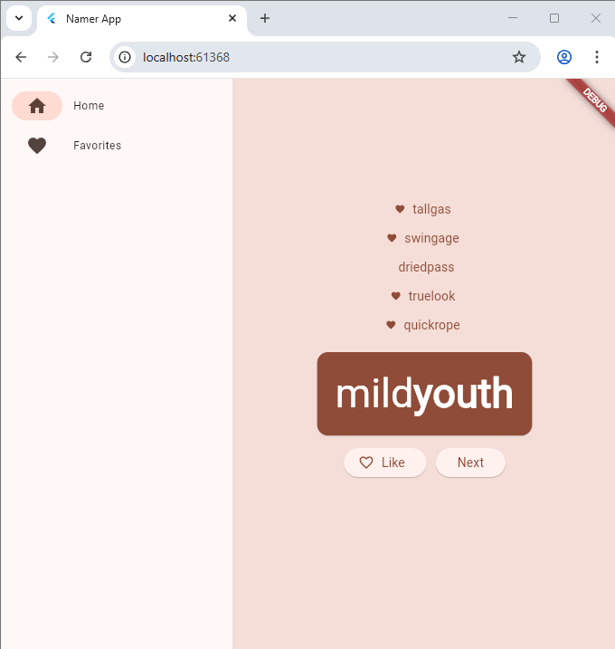 

